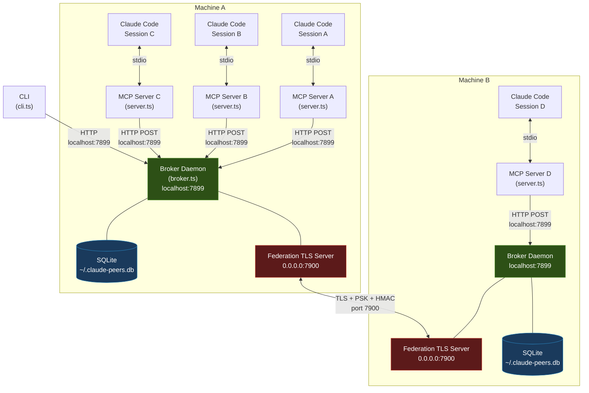
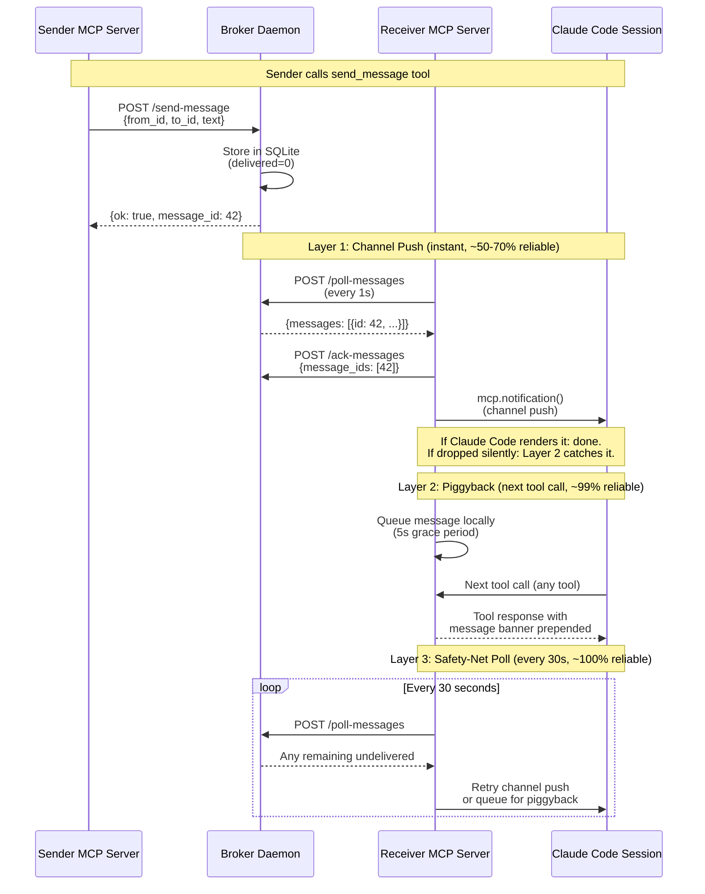
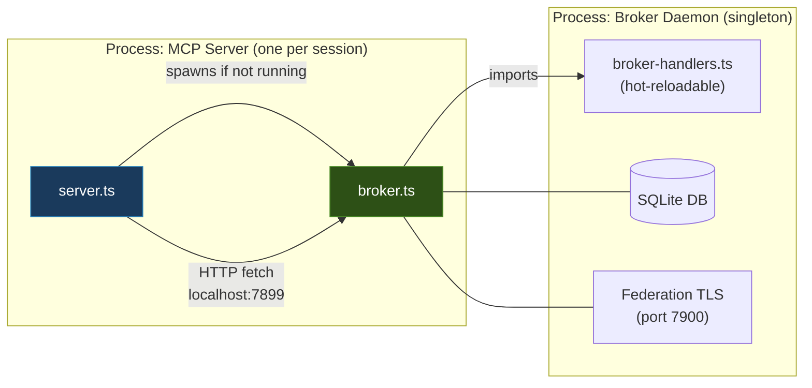
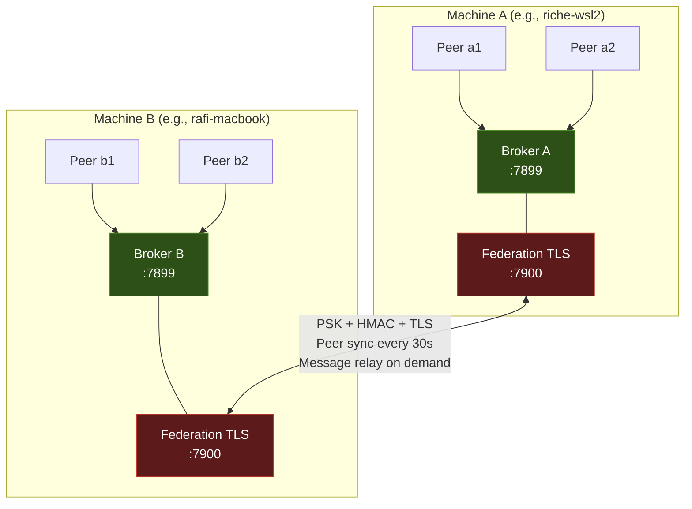
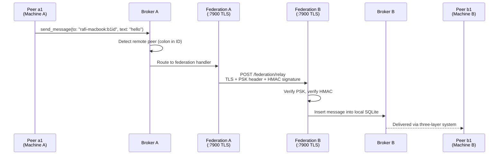
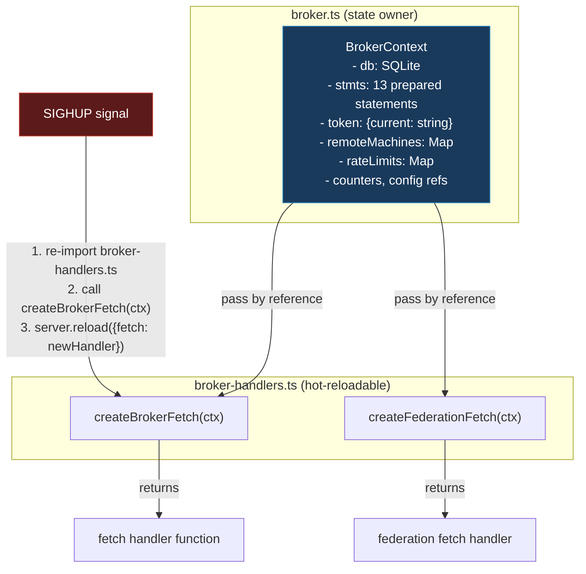
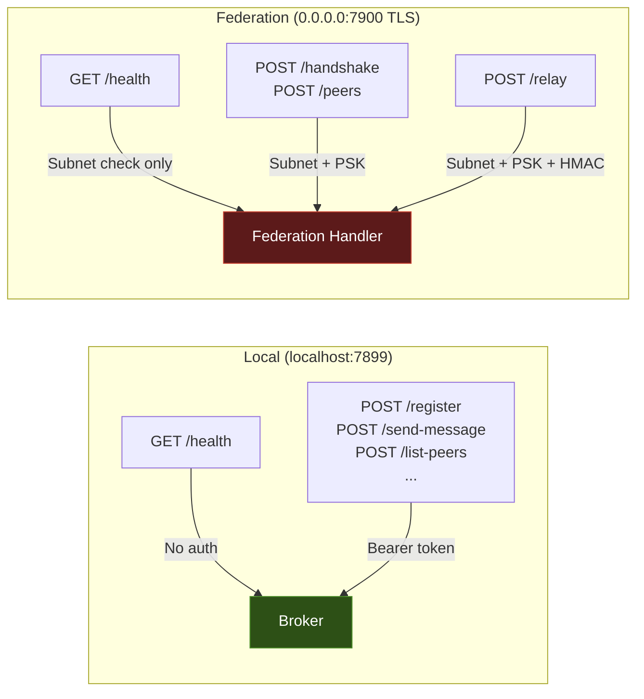

# Architecture

This document describes the internal architecture of claude-peers-mcp -- the peer discovery and messaging system for Claude Code instances.

## System Overview

claude-peers-mcp enables multiple Claude Code sessions to discover each other, exchange messages in real time, and coordinate work. It operates as an MCP (Model Context Protocol) server that gives each Claude Code session access to peer discovery and messaging tools. A shared broker daemon manages all state and routes messages between sessions.

The system supports both **local** operation (multiple sessions on one machine) and **federated** operation (sessions across machines on a LAN) with TLS encryption and pre-shared key authentication.

## Component Diagram



**Key observations:**

- Each Claude Code session gets its own MCP server process (stdio transport).
- All MCP servers on a machine share a single broker daemon (HTTP on localhost:7899).
- The federation TLS server runs in the same process as the broker (second `Bun.serve()` on port 7900).
- The CLI is a one-shot process that communicates with the broker over HTTP -- it does not persist.

## Message Flow -- Three-Layer Delivery

Claude Code's channel notification system silently drops ~30-50% of messages at the platform level. To compensate, claude-peers uses three independent delivery layers:



**Layer details:**

| Layer | Mechanism | Latency | Reliability | Failure Mode |
|-------|-----------|---------|-------------|--------------|
| **1. Channel push** | `mcp.notification()` pushes directly into session | Instant | ~50-70% | Claude Code silently drops the notification |
| **2. Piggyback** | Queued messages prepended to next tool call response | Next tool call (seconds) | ~99% | Session has no tool calls (idle) |
| **3. Safety-net poll** | Polls broker every 30s, retries channel push | Up to 30s | ~100% | Broker is down |

## Process Model

broker.ts and server.ts are **separate processes** with distinct lifecycles:



### Broker (broker.ts) -- Singleton Daemon

- **Lifecycle:** Spawned by the first MCP server via `Bun.spawn()`. Persists across `/mcp` reconnects. Survives individual session exits.
- **Binding:** `127.0.0.1:7899` (HTTP, localhost only). `0.0.0.0:7900` (TLS, federation, LAN-facing).
- **State:** SQLite database (`~/.claude-peers.db`), in-memory maps for federation remotes and rate limits.
- **Cleanup:** Stale peers (dead PIDs) cleaned every 30s. Delivered messages purged after 7 days. Orphaned messages bounced back to senders.
- **Restart:** `bun src/cli.ts kill-broker` or `bunx claude-peers kill-broker`. Auto-restarts on next MCP server connect.

### MCP Server (server.ts) -- One Per Session

- **Lifecycle:** Started by Claude Code as a stdio MCP server. Dies when the Claude Code session exits. Restarted on `/mcp` reconnect.
- **Transport:** stdio (stdin/stdout for MCP protocol, stderr for logging).
- **Broker communication:** HTTP POST to `localhost:7899` with bearer token auth.
- **Polling:** Every 1s for new messages, every 15s for heartbeat.
- **Auto-reconnect:** After 5 consecutive poll failures (~5 seconds), re-registers with the broker automatically. Session name and summary are restored.

### CLI (cli.ts) -- On-Demand

- **Lifecycle:** Runs as a one-shot command, exits when done.
- **Communication:** HTTP to `localhost:7899` with bearer token auth.
- **No restart needed:** CLI always runs fresh code -- changes to cli.ts take effect immediately.

## Federation Topology



**Federation protocol:**

1. **Handshake:** Machine A sends `POST /federation/handshake` with PSK token and hostname. Machine B verifies PSK and responds with its hostname.
2. **Peer sync:** Every 30 seconds, each broker fetches the other's peer list via `POST /federation/peers`. Stale remotes (>90s since last sync) are evicted.
3. **Message relay:** When a local peer sends to a remote peer (identified by `hostname:peer_id` format), the broker relays via `POST /federation/relay` with HMAC-SHA256 signature.
4. **Auto-reconnect:** On broker restart, saved remotes from `~/.claude-peers-config.json` are reconnected with exponential backoff (0s, 5s, 15s, 45s, then 60s intervals, up to 20 attempts).

**Cross-machine message path:**



## Hot-Reload Architecture

The broker supports SIGHUP-based hot-reload for handler code changes without dropping connections or losing state.



**How it works:**

1. `broker.ts` owns all state in a `BrokerContext` object (database, prepared statements, Maps, config refs).
2. `broker-handlers.ts` exports factory functions (`createBrokerFetch`, `createFederationFetch`) that accept `BrokerContext` and return `fetch` handler functions.
3. On SIGHUP, broker.ts re-imports `broker-handlers.ts` with cache-busting (`?v=${Date.now()}`), calls the factory with the same `BrokerContext`, and swaps the handler via `Bun.serve().reload()`.
4. State survives because `BrokerContext` is passed by reference -- the new handlers operate on the same objects.
5. If the import fails, the previous handlers remain active (rollback on error).

**Trigger SIGHUP:**

```bash
kill -HUP $(lsof -ti :7899)
# Or:
bun src/cli.ts reload-broker
```

## Database Schema

The broker uses SQLite (`~/.claude-peers.db`) with WAL mode and two tables:

### peers

| Column | Type | Description |
|--------|------|-------------|
| `id` | TEXT PRIMARY KEY | SHA-256 hash of TTY (8 chars), stable across `/mcp` reconnects |
| `pid` | INTEGER NOT NULL | OS process ID, used for liveness checks |
| `cwd` | TEXT NOT NULL | Working directory of the Claude Code session |
| `git_root` | TEXT | Git repository root (null if not in a repo) |
| `tty` | TEXT | Terminal device (e.g., `pts/44`) |
| `session_name` | TEXT DEFAULT '' | Human-readable name from `/rename` (e.g., `AUTH_WORKER`) |
| `summary` | TEXT DEFAULT '' | Work summary visible to peers |
| `version` | TEXT DEFAULT '' | CPM version string (e.g., `0.7.0`) |
| `channel_push` | TEXT DEFAULT 'unknown' | Channel push status: `unknown`, `unverified`, `working` |
| `registered_at` | TEXT NOT NULL | ISO 8601 timestamp of first registration |
| `last_seen` | TEXT NOT NULL | ISO 8601 timestamp of last heartbeat |

### messages

| Column | Type | Description |
|--------|------|-------------|
| `id` | INTEGER PRIMARY KEY AUTOINCREMENT | Unique message ID |
| `from_id` | TEXT NOT NULL | Sender peer ID (or `system` for bounce messages) |
| `to_id` | TEXT NOT NULL | Recipient peer ID |
| `text` | TEXT NOT NULL | Message content (max 10KB with metadata combined) |
| `type` | TEXT DEFAULT 'text' | Message type: `text`, `query`, `response`, `handoff`, `broadcast` |
| `metadata` | TEXT DEFAULT NULL | JSON string of structured metadata |
| `reply_to` | INTEGER DEFAULT NULL | ID of parent message (for threading) |
| `sent_at` | TEXT NOT NULL | ISO 8601 timestamp |
| `delivered` | INTEGER DEFAULT 0 | `0` = pending, `1` = acknowledged by recipient |

**Maintenance:**

- Dead peers (PID check fails) are cleaned every 30 seconds.
- Delivered messages older than 7 days are purged every 60 seconds.
- Orphaned messages (recipient peer no longer exists) are bounced back to senders.

## Authentication

claude-peers uses different authentication mechanisms for local and federated communication:

### Local Authentication (Bearer Token)

- **Scope:** All POST endpoints on `localhost:7899` (MCP server-to-broker, CLI-to-broker).
- **Token:** Auto-generated 64-character hex string stored at `~/.claude-peers-token` with `0o600` permissions.
- **Header:** `Authorization: Bearer <token>`.
- **Rotation:** Send SIGHUP to broker (`bun src/cli.ts reload-broker`). Token is re-read from disk every 60 seconds automatically.
- **Retry:** On 401, MCP servers re-read the token file and retry once (handles rotation during active sessions).

### Unauthenticated Endpoints

- `GET /health` -- Health check, returns peer count and uptime. No auth required.
- `GET /federation/status` -- Federation connection status. No auth required.

### Federation Authentication (PSK + HMAC)

- **PSK (Pre-Shared Key):** Both machines must share the same `~/.claude-peers-token` file. Sent in `X-Claude-Peers-PSK` header on all federation requests.
- **HMAC-SHA256:** Message relay requests (`/federation/relay`) include an HMAC signature computed over the canonicalized request body (top-level keys sorted alphabetically). The recipient verifies the signature before accepting the message.
- **TLS:** All federation communication uses self-signed TLS certificates (RSA-2048 for macOS LibreSSL compatibility). The `curl -sk` workaround is used because Bun 1.3.x `fetch()` does not support `tls: { rejectUnauthorized: false }`.
- **Subnet Filtering:** Configurable CIDR allowlist (`CLAUDE_PEERS_FEDERATION_SUBNET`). Connections from outside the subnet are rejected at the federation TLS server level before PSK validation.
- **Timing-Safe Comparison:** Both bearer token and PSK comparisons use `crypto.timingSafeEqual` to prevent timing side-channel attacks.


