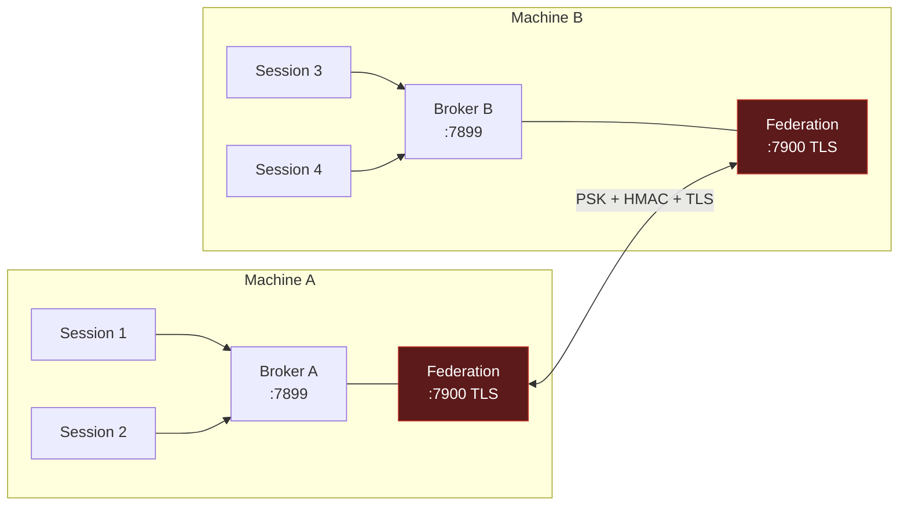
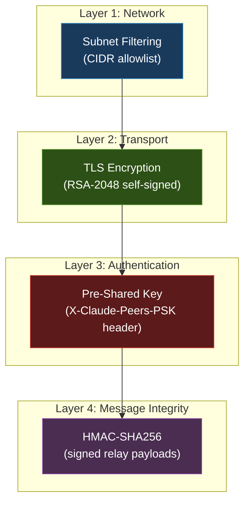

# Federation Guide

Federation lets claude-peers instances on different machines discover and message each other over your local network. All traffic is encrypted with TLS and authenticated with a pre-shared key (PSK).

## What is Federation?

By default, claude-peers operates on a single machine -- all Claude Code sessions share one broker daemon on `localhost:7899`. Federation extends this to multiple machines on a LAN by adding a TLS-encrypted server (port 7900) that brokers use to exchange peer lists and relay messages.



With federation enabled:

- `list_peers(scope="lan")` returns peers from all connected machines.
- `send_message` works across machines using the `hostname:peer_id` format (e.g., `rafi-macbook:a1b2c3d4`).
- `broadcast_message(scope="lan")` reaches peers on all machines.
- Peer lists sync every 30 seconds. Messages relay on demand.

## Prerequisites

Both machines need:

1. **Bun** (v1.1+) installed -- [bun.sh](https://bun.sh)
2. **claude-peers-mcp** installed (npm or from source)
3. **Network connectivity** on port 7900 (TCP) between machines
4. **Same token** -- both machines must share `~/.claude-peers-token`

## Quick Start (One Command)

The fastest way to set up federation between two machines.

### Machine A (the first machine)

```bash
# npm install:
bunx claude-peers federation init

# source install:
bun src/cli.ts federation init
```

This command:
1. Creates/updates `~/.claude-peers-config.json` with federation enabled
2. Generates a self-signed TLS certificate (RSA-2048)
3. Sets up platform-specific networking (port forwarding on WSL2, firewall on macOS)
4. Restarts the broker with federation active
5. Outputs a `cpt://` join URL

Copy the `cpt://` URL it displays. It looks like:

```
cpt://192.168.1.100:7900/dGhpcyBpcyBhIHRlc3Q...
```

> **Warning:** This URL contains your authentication token. Share it only with trusted machines on your LAN.

### Machine B (joining)

```bash
# npm install:
bunx claude-peers federation join cpt://192.168.1.100:7900/dGhpcyBpcyBhIHRlc3Q...

# source install:
bun src/cli.ts federation join cpt://192.168.1.100:7900/dGhpcyBpcyBhIHRlc3Q...
```

This command:
1. Extracts the token from the URL and writes it to `~/.claude-peers-token`
2. Updates config with federation enabled and the remote added
3. Generates a TLS certificate
4. Restarts the broker
5. Connects to Machine A automatically

### Verify

```bash
# On either machine:
bunx claude-peers federation doctor     # npm
bun src/cli.ts federation doctor        # source
```

Doctor checks: config file, token, TLS certs, broker status, federation TLS listener, LAN IP, connected remotes, and config/actual mismatches.

You can also regenerate the join URL at any time:

```bash
bunx claude-peers federation token      # npm
bun src/cli.ts federation token         # source
```

## Manual Setup

Use this when `federation init` + `federation join` doesn't work, or when you need more control.

### Step 1: Enable Federation

On **both machines**, create or update `~/.claude-peers-config.json`:

```json
{
  "federation": {
    "enabled": true,
    "port": 7900,
    "subnet": "192.168.1.0/24"
  }
}
```

Or use the CLI:

```bash
bunx claude-peers federation enable 7900 192.168.1.0/24    # npm
bun src/cli.ts federation enable 7900 192.168.1.0/24       # source
```

### Step 2: Share the Token

Both machines must have the same `~/.claude-peers-token` file. Copy it from Machine A to Machine B:

```bash
scp ~/.claude-peers-token user@machine-b:~/.claude-peers-token
```

Or manually copy the single-line hex string in the file.

### Step 3: Generate TLS Certificates

Certificates are auto-generated on broker startup if missing. To generate them explicitly:

```bash
# The broker generates certs on first start with federation enabled.
# Or use openssl directly:
openssl req -newkey rsa:2048 -noenc -keyout ~/.claude-peers-federation.key \
  -x509 -days 365 -out ~/.claude-peers-federation.crt -subj /CN=$(hostname)
chmod 600 ~/.claude-peers-federation.key
```

### Step 4: Restart the Broker

```bash
bunx claude-peers kill-broker           # npm
bun src/cli.ts kill-broker              # source
# Broker auto-restarts on next MCP session connect
```

Or set the environment variable and start manually:

```bash
CLAUDE_PEERS_FEDERATION_ENABLED=true bun src/broker.ts
```

### Step 5: Connect

From either machine, connect to the other:

```bash
bunx claude-peers federation connect 192.168.1.42:7900     # npm
bun src/cli.ts federation connect 192.168.1.42:7900        # source
```

Connections are persisted to `~/.claude-peers-config.json` and auto-reconnect on broker restart.

### Step 6: Verify

```bash
bunx claude-peers federation status     # npm
bun src/cli.ts federation status        # source
```

Should show the connected remote with its hostname and peer count.

## WSL2 Setup

WSL2 has additional requirements because it runs behind a NAT adapter (Hyper-V). External traffic cannot reach WSL2 directly without port forwarding.

### Key Differences

| Aspect | Native Linux/macOS | WSL2 |
|--------|-------------------|------|
| Network | Direct LAN access | NAT behind Hyper-V |
| Port forwarding | Not needed | Required (netsh) |
| Subnet restriction | Auto-detected (e.g., `192.168.1.0/24`) | Must be `0.0.0.0/0` |
| IP stability | Stable | Changes on reboot |
| mDNS | Works | Blocked (multicast not forwarded) |

### Why `0.0.0.0/0` Subnet?

Windows port forwarding rewrites the source IP address of incoming packets to the Windows host IP before forwarding to WSL2. This means the federation TLS server inside WSL2 sees the Windows host IP, not the remote machine's real IP. Subnet filtering would reject legitimate connections.

Security still relies on PSK authentication + TLS encryption, which are independent of source IP.

### Port Forwarding

`federation init` sets up port forwarding automatically via elevated PowerShell. If you need to do it manually:

```powershell
# Run in elevated PowerShell (Admin):
netsh interface portproxy add v4tov4 `
  listenport=7900 listenaddress=0.0.0.0 `
  connectport=7900 connectaddress=<WSL2_IP>

# Add firewall rule:
New-NetFirewallRule -DisplayName "Claude-Peers-Federation" `
  -Direction Inbound -Action Allow -Protocol TCP -LocalPort 7900
```

Get your WSL2 IP with: `hostname -I` (inside WSL2).

### After Reboot

WSL2 gets a new IP on each reboot. The port forwarding rule points to the old IP. Run:

```bash
bunx claude-peers federation refresh-wsl2     # npm
bun src/cli.ts federation refresh-wsl2        # source
```

This detects the new WSL2 IP and updates the portproxy rule (requires admin elevation).

### WSL2 Mirrored Mode

If you have `networkingMode=mirrored` in your `.wslconfig`:

```ini
# C:\Users\<username>\.wslconfig
[wsl2]
networkingMode=mirrored
```

Port forwarding is **not required** -- WSL2 shares the host's network interfaces directly. `federation refresh-wsl2` will detect this and skip port forwarding.

**Note:** Mirrored mode has known reliability issues. If federation connections are unstable, consider switching back to NAT mode with port forwarding.

## macOS Setup

### Firewall

macOS may block incoming connections on port 7900. If connections are refused:

```bash
# Allow Bun through the application firewall:
sudo /usr/libexec/ApplicationFirewall/socketfilterfw \
  --add $(which bun) --unblockapp $(which bun)
```

Or temporarily disable the firewall in System Settings > Network > Firewall.

### TLS Certificate Compatibility

macOS uses LibreSSL, which has limited support for Ed25519 certificates. claude-peers defaults to RSA-2048 certificates for compatibility. If you previously generated an Ed25519 cert (pre-v0.3.0), regenerate:

```bash
rm ~/.claude-peers-federation.crt ~/.claude-peers-federation.key
bunx claude-peers kill-broker           # npm
bun src/cli.ts kill-broker              # source
# Broker auto-generates new RSA-2048 cert on restart
```

### Finding Your LAN IP

```bash
ipconfig getifaddr en0                  # Wi-Fi
ipconfig getifaddr en1                  # Ethernet (some Macs)
```

## Verification

### `federation doctor`

The most comprehensive check. Run it on any machine:

```bash
bunx claude-peers federation doctor     # npm
bun src/cli.ts federation doctor        # source
```

**What it checks:**

1. Config file exists and federation is enabled
2. Auth token file exists
3. TLS certificate and key exist
4. Broker is running
5. Federation TLS server is listening
6. LAN IP is detectable
7. Remote connections match config (warns about mismatches)
8. Each connected remote is reachable

### `federation status`

Quick view of federation state:

```bash
bunx claude-peers federation status     # npm
bun src/cli.ts federation status        # source
```

Shows: enabled/disabled, port, subnet, connected remotes with hostname, peer count, connection time, and last sync time.

### Direct Connectivity Test

From the **remote** machine, test if you can reach the federation port:

```bash
# Should return JSON with hostname
curl -sk https://<target-ip>:7900/health

# Expected response:
# {"status":"ok","federation":true,"hostname":"riche-wsl2"}
```

If this returns "connection refused" or times out, the issue is network-level (firewall, port forwarding, routing).

## Troubleshooting

### Connection Refused

**Cause:** The federation TLS server is not listening, or a firewall is blocking port 7900.

**Check:**
1. Is the broker running? `bunx claude-peers status`
2. Is federation enabled? Check `cpm-logs/federation.log` for `Listening on 0.0.0.0:7900 (TLS)`
3. Can you reach the port? `curl -sk https://<ip>:7900/health`
4. WSL2: Is port forwarding set up? `netsh interface portproxy show v4tov4` (in PowerShell)
5. macOS: Is the firewall blocking Bun?

### Subnet Mismatch

**Symptom:** `Connection rejected: <IP> is outside allowed subnet <CIDR>`

**Fix:** Update the subnet to include the connecting IP:

```bash
# In ~/.claude-peers-config.json:
"subnet": "0.0.0.0/0"

# Or via env var:
export CLAUDE_PEERS_FEDERATION_SUBNET=0.0.0.0/0
```

Then reload the broker:

```bash
bunx claude-peers reload-broker         # npm
bun src/cli.ts reload-broker            # source
```

### TLS Handshake Failure

**Symptom:** `SSL connect error` or `Handshake failed (0): unknown`

**Most likely cause (macOS to Linux):** The remote machine has an Ed25519 certificate that macOS LibreSSL cannot negotiate.

**Fix:** Regenerate the cert on the remote:

```bash
rm ~/.claude-peers-federation.crt ~/.claude-peers-federation.key
bunx claude-peers kill-broker           # npm
bun src/cli.ts kill-broker              # source
# Broker auto-generates new RSA-2048 cert
```

### PSK Mismatch

**Symptom:** `PSK mismatch -- ensure both machines share the same ~/.claude-peers-token file`

**Fix:** The token files differ. Copy one to the other:

```bash
scp ~/.claude-peers-token user@other-machine:~/.claude-peers-token
```

Then reload brokers on both machines:

```bash
bunx claude-peers reload-broker         # npm
bun src/cli.ts reload-broker            # source
```

### Peers Not Syncing

**Symptom:** `list_peers(scope="lan")` returns only local peers, no remotes.

**Check:**
1. Is federation enabled? `bunx claude-peers federation status`
2. Are remotes connected? Look for `"remotes": [...]` in the status output.
3. Check federation logs: `tail -f cpm-logs/federation.log`
4. If remotes show but no peers: the remote broker may have no active sessions. Start a Claude Code session on the remote machine.

### Connection Lost After Broker Restart

**Expected behavior:** Connections auto-reconnect. The broker reads saved remotes from `~/.claude-peers-config.json` on startup and reconnects with exponential backoff (0s, 5s, 15s, 45s, then 60s intervals, up to 20 attempts).

If auto-reconnect is not working, check that the remote is listed in the config:

```bash
cat ~/.claude-peers-config.json
```

Look for `federation.remotes` array. If empty, manually connect:

```bash
bunx claude-peers federation connect <ip>:7900
```

## Security Model

Federation uses defense in depth with four layers:



| Layer | Mechanism | What It Protects Against |
|-------|-----------|------------------------|
| **Subnet filtering** | CIDR allowlist on incoming connections | Connections from outside your LAN |
| **TLS encryption** | Self-signed RSA-2048 certificates | Eavesdropping and man-in-the-middle |
| **PSK authentication** | Shared token in header, timing-safe comparison | Unauthorized brokers connecting |
| **HMAC signing** | SHA-256 HMAC on canonicalized relay bodies | Message tampering during relay |

**Important notes:**

- The PSK is the **same token** used for local bearer auth (`~/.claude-peers-token`). Anyone with this token can impersonate a broker.
- Self-signed certificates mean no CA verification -- trust is established by PSK match, not certificate chain.
- On WSL2, subnet filtering is effectively disabled (`0.0.0.0/0`) because port forwarding rewrites source IPs. Security relies on PSK + TLS.
- The local broker HTTP API (`localhost:7899`) is **never** exposed to the network. Only the federation TLS server (`0.0.0.0:7900`) is LAN-facing.

## mDNS Auto-Discovery

When federation is enabled, brokers advertise a `_claude-peers._tcp` service on the LAN via mDNS/Bonjour. Machines with matching PSK tokens auto-connect within ~60 seconds -- no manual `federation connect` needed.

**Limitations:**

- Does **not** work on WSL2 NAT mode (multicast is blocked by Hyper-V). Use `federation init` + `federation join` instead.
- WSL2 mirrored mode may work but is unreliable.
- Requires `bonjour-service` npm package (included as a dependency).

**Disable mDNS:**

```json
{
  "federation": {
    "mdns": {
      "enabled": false
    }
  }
}
```

Or: `CLAUDE_PEERS_MDNS_ENABLED=false`

## CLI Reference

| Command | Description |
|---------|-------------|
| `federation init` | One-command setup: config, certs, firewall, broker restart, join URL |
| `federation join <cpt-url>` | Join federation using a `cpt://` URL from another machine |
| `federation token` | Generate a `cpt://` join URL for sharing |
| `federation doctor` | Comprehensive health check of federation prerequisites |
| `federation status` | Show federation state and connected remotes |
| `federation connect <host>:<port>` | Connect to a remote broker (persists to config) |
| `federation disconnect <host>:<port>` | Disconnect from a remote broker (removes from config) |
| `federation enable [port] [subnet]` | Enable federation in config file |
| `federation disable` | Disable federation in config file |
| `federation refresh-wsl2` | Update WSL2 port forwarding after reboot |

## Environment Variables

| Variable | Default | Description |
|----------|---------|-------------|
| `CLAUDE_PEERS_FEDERATION_ENABLED` | `false` | Enable/disable federation (overrides config file) |
| `CLAUDE_PEERS_FEDERATION_PORT` | `7900` | Federation TLS port |
| `CLAUDE_PEERS_FEDERATION_SUBNET` | auto-detected | CIDR range for allowed connections |
| `CLAUDE_PEERS_FEDERATION_CERT` | `~/.claude-peers-federation.crt` | TLS certificate path |
| `CLAUDE_PEERS_FEDERATION_KEY` | `~/.claude-peers-federation.key` | TLS private key path |
| `CLAUDE_PEERS_MDNS_ENABLED` | `true` | Enable/disable mDNS auto-discovery |
